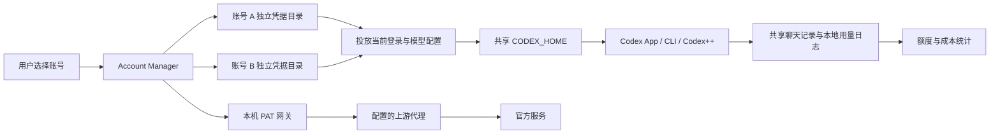

# Codex Account Manager

[](https://github.com/bennettnaida-cloud/codex-account-manager/actions/workflows/build-latest.yml)
[](https://github.com/bennettnaida-cloud/codex-account-manager/releases/tag/latest)
[](LICENSE)

Codex Account Manager 是一个在本机运行的 Codex 多账号管理器。它把每个账号的登录凭据隔离保存，同时让 Codex 桌面客户端和 CLI 共用同一份聊天记录，并提供账号切换、额度查看、本地用量统计、模型价格同步、代理配置和自动更新。

> 本项目是非官方工具，与 OpenAI 没有隶属或背书关系。请只使用自己有权使用的账号、Access Token 或 API Key，并遵守相关服务条款。

## 下载

| 平台 | 安装包 | 校验文件 | 要求 |
| --- | --- | --- | --- |
| Windows | [下载最新一键安装包](https://github.com/bennettnaida-cloud/codex-account-manager/releases/download/latest/CodexAccountManager-Windows-latest.zip) | [SHA-256](https://github.com/bennettnaida-cloud/codex-account-manager/releases/download/latest/CodexAccountManager-Windows-latest.zip.sha256) | Windows 10/11 x64 |
| macOS | [下载 Apple Silicon 安装包](https://github.com/bennettnaida-cloud/codex-account-manager/releases/download/latest/CodexAccountManager-macOS-latest.zip) | [SHA-256](https://github.com/bennettnaida-cloud/codex-account-manager/releases/download/latest/CodexAccountManager-macOS-latest.zip.sha256) | Apple Silicon，macOS 12+ |

也可以打开 [Latest Release](https://github.com/bennettnaida-cloud/codex-account-manager/releases/tag/latest) 查看版本、发布时间和全部文件。

安装包内置运行所需的 Codex CLI。Windows 不要求另装 .NET，macOS 不要求另装 Node.js。

## 这个项目解决什么问题

直接使用多个 Codex 账号时，登录文件、账号配置、模型选择和聊天记录通常都位于同一个 `CODEX_HOME`，切换账号容易覆盖凭据，也容易让历史任务跟着账号目录分散。

本项目将这两类数据分开处理：

- 每个账号拥有独立的凭据目录，登录状态、API Key、Access Token 和账号配置互不覆盖。
- 聊天记录集中保存在默认 Codex 目录，切换账号后仍可查看原来的任务。
- 启动 Codex 前只投放当前账号所需的登录与模型配置，不复制或删除共享聊天记录。
- 额度与成本页面只读取官方额度信息和本地自然产生的用量日志，不会为了测额度主动调用模型。
- 模型与价格目录可以通过配置的代理检查官方页面，也允许手动修正并保留内置价格作为离线后备。

## 主要功能

- 管理多个 Access Token 或兼容 OpenAI API 的 API Key 账号。
- 在账号之间切换，并启动官方 Codex 桌面应用、Codex++ 或 CLI。
- 聊天页先显示本地缓存，再通过当前 Codex app-server 在后台同步共享目录与短标题；支持打开、归档、取消归档和永久删除，Codex 暂不可用时仍可使用缓存。
- 按账号读取官方额度窗口、重置时间、Credits 和可重置次数。
- 从本地 JSONL 与 SQLite 日志统计 Token、缓存写入和逐模型 API 等值成本。
- 提供 1h、5h、今天、本周、本月趋势、模型分布和 CSV 导出。
- 在系统配置中管理项目目录、启动目录、HTTP/SOCKS5 上游代理和自动检测。
- 通过代理检查官网模型及价格；价格表可手动编辑、恢复内置值，并按最新模型优先显示。
- 支持浅色、深色、跟随系统以及可选的 Codex 主题。
- 从 GitHub `latest` Release 检查更新，显示下载进度，校验 SHA-256 后原位升级并自动重启。

## 工作原理



### 1. 凭据隔离与聊天共享

账号目录只保存该账号的登录凭据和账号配置。真正启动 Codex 时，管理器会先备份需要保护的现有登录状态，再把当前账号的必要配置原子投放到共享 `%USERPROFILE%\.codex`。历史会话不会随账号切换，也不会因为切换凭据而删除。

### 2. Access Token 本机网关

Access Token 模式使用只监听回环地址的本机网关。网关校验当前账号及工作区标识，并将请求转发到固定的官方后端；如果配置了上游代理，请求会通过该代理发送。网关不向局域网开放，也不会把多个账号合并成同一份凭据。

兼容 API 账号则使用各自配置的 API 地址、API Key 和模型，不经过 Access Token 账号的额度逻辑。

### 3. 额度与本地用量

官方额度由每个账号自己的凭据通过只读接口刷新。Token 与成本统计来自本机自然使用产生的日志，并通过增量索引避免每次重新扫描全部历史。界面中的美元金额是按模型价格换算的 API 等值估算，不是官方美元余额或实际账单。

被动额度监测必须由用户手动开启。软件不会发送测试提示、进行压力测试或为了测量而额外调用模型。

### 4. 模型与价格同步

系统配置中的“通过代理检查官网”会执行以下流程：

1. 使用当前代理读取官方模型目录和模型页面。
2. 发现受支持的新模型并解析输入、缓存输入、缓存写入、输出及长上下文价格。
3. 校验结果完整性，成功后保存为本机官网校验目录；失败时保留当前价格，不覆盖可用配置。
4. 模型按版本从新到旧显示，并同步官网推荐的默认模型。

价格表可以手动编辑并保存，也可以恢复安装包内置值。再次成功检查官网后，以官网校验结果为准。这样既能跟随官方更新，也能在官网页面或网络暂时不可用时继续工作。

## Windows 安装与使用

1. 下载 `CodexAccountManager-Windows-latest.zip`，并核对同名 `.sha256` 文件。
2. 完整解压 ZIP，不要直接在压缩软件预览窗口中运行。
3. 双击 `一键安装 Codex Account Manager.cmd`。
4. 安装完成后，从桌面或开始菜单打开 Codex Account Manager。
5. 首次使用先进入“系统配置”，设置项目目录、启动目录和需要的代理。
6. 点击“新增账号”，填写账号名称和独立凭据目录，再录入 Access Token 或 API Key。
7. 在账号卡片检查状态，然后选择“Codex 启动”“Codex++ 启动”或 CLI。

默认安装目录是 `%LOCALAPPDATA%\Programs\CodexAccountManager`，不需要管理员权限。程序没有商业代码签名证书；SmartScreen 提示时，请先确认下载地址和 SHA-256，再选择“更多信息 → 仍要运行”。

## 更新与卸载

- 软件会检查 GitHub `latest` Release；确认有新版本后，可在界面中下载并安装。
- Windows 自动更新会在当前安装目录完成覆盖升级并自动重启；账号、设置、工作目录和本地统计都会保留。更新失败时会重新打开原版本并给出日志位置。
- 也可以重新下载并运行一键安装包完成覆盖升级。
- 可从 Windows“设置 → 应用 → 已安装的应用”卸载，或运行安装目录中的卸载脚本。
- 卸载默认保留账号配置、凭据目录和聊天记录，避免误删用户数据。

## 数据与安全边界

公开仓库和 Release 安装包不应包含任何真实账号或运行时数据，包括：

- `accounts.json`、`appsettings.json` 和真实账号目录；
- `auth.json`、Access Token、API Key、Cookie 或代理凭据；
- `sessions`、`archived_sessions`、JSONL、SQLite 和聊天记录；
- 额度快照、本地日志、缓存与用户绝对路径。

发布脚本会检查默认配置、敏感字段、私钥、个人邮箱、本机路径、聊天数据库和调试文件，并在隔离目录执行安装与应用自检。安装包及更新清单都包含 SHA-256 校验值。

请不要把安装后生成的数据目录、Token、日志或整个个人工作目录上传到 Issue、PR 或 Release。

## 从源码构建

Windows：

```powershell
.\Build-CodexAccountManager.ps1
.\Build-OneClickInstallerPackage.ps1
```

构建脚本会下载或使用固定版本的 Codex CLI 运行组件。第三方组件说明见 [THIRD_PARTY_LICENSES.md](THIRD_PARTY_LICENSES.md)。

## 发布方式

仓库使用 [Build and publish latest packages](https://github.com/bennettnaida-cloud/codex-account-manager/actions/workflows/build-latest.yml) 自动发布：

1. 将经过测试的源码和 README 推送到 `main`。
2. GitHub Actions 构建并验证 Windows 安装包；macOS 安装包作为独立发布资产维护，不阻塞 Windows CI。
3. 工作流覆盖 `latest` Release 中固定名称的 ZIP、SHA-256 和 `update-manifest.json`。
4. README 的下载链接始终指向 `latest`，以后无需修改下载地址，也不要把大型 ZIP 提交到 Git 仓库。

因此后续维护时，项目介绍只需更新本 README；安装包由工作流根据 `main` 自动生成并替换。

## 参与和许可

- 开源协作规则：[CONTRIBUTING.md](CONTRIBUTING.md)
- 安全问题：[SECURITY.md](SECURITY.md)
- 开源许可：[MIT License](LICENSE)
